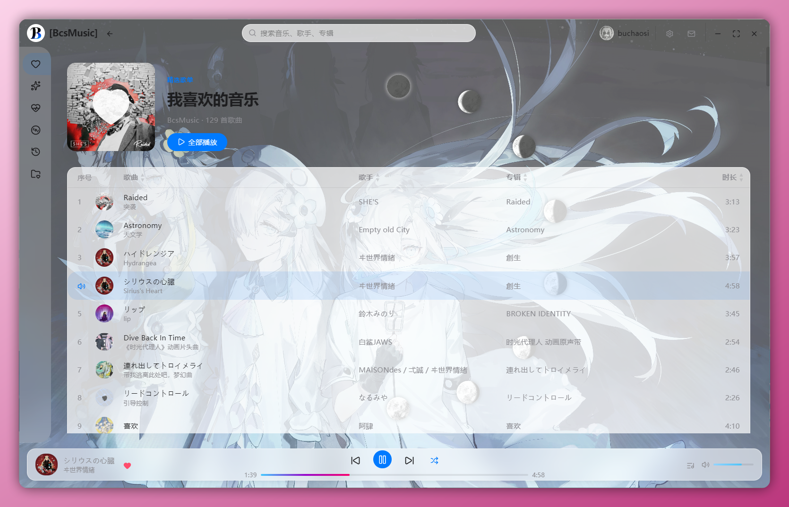
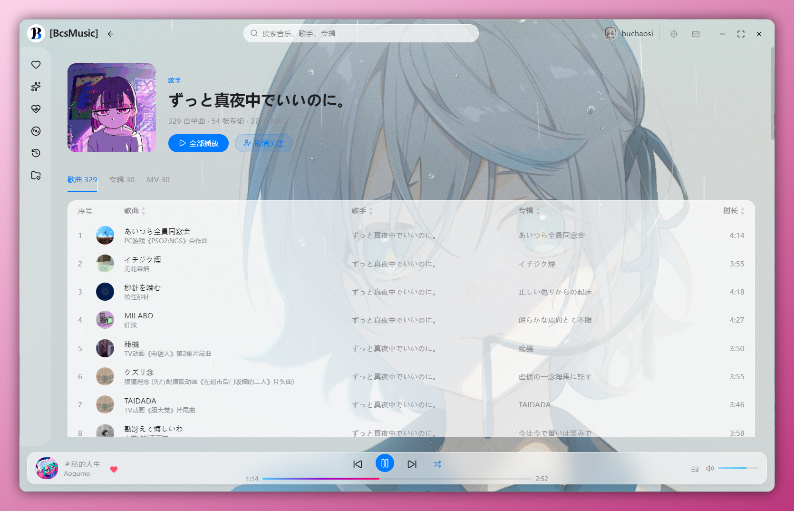

# 网易云音乐桌面客户端

一个基于 Electron 和 Rust 开发的跨平台网易云音乐桌面客户端，支持 Windows SMTC (System Media Transport Controls) 集成。

## ✨ 功能特性

- 🎵 可登录网易云音乐同步资源
- 🖥️ Windows SMTC 原生支持（通过 Rust 实现）
- 🎨 现代化的用户界面
- ⚡ 基于 Electron 
- 🔐 安全的进程间通信（IPC）
- 📦 一键打包构建

## 📸 软件截图

<!-- 请在此处插入软件截图 -->





<!-- 如需更多截图，可继续添加 -->
<!--  -->

## 🛠️ 技术栈

- **前端**: HTML5, CSS3, JavaScript
- **框架**: Electron 33+
- **后端 API**: NeteaseCloudMusicApi
- **原生模块**: Rust (Windows SMTC 支持)
- **打包工具**: electron-builder

## 📦 项目结构

```
├── main/                 # Electron 主进程代码
│   ├── index.js         # 主进程入口
│   ├── ipc.js           # IPC 通信处理
│   ├── netease.js       # 网易云 API 集成
│   ├── smtc.js          # SMTC 功能模块
│   └── store.js         # 数据存储模块
├── preload/             # 预加载脚本
│   └── index.js
├── renderer/            # 渲染进程（前端界面）
│   ├── index.html
│   ├── css/
│   ├── js/
│   └── images/
├── smtc-native/         # Rust SMTC 原生模块
│   ├── src/
│   ├── Cargo.toml
│   └── build.rs
├── build/               # 构建资源（图标等）
├── scripts/             # 辅助脚本
├── package.json         # 项目配置
└── README.md            # 项目说明
```

## 🚀 快速开始

### 前置要求

- Node.js >= 18.x
- npm >= 9.x
- Rust 工具链（用于构建 SMTC 原生模块）
  - Windows: 安装 [Rust](https://rustup.rs/)
  - 需要 Visual Studio Build Tools（Windows 平台）

### 安装依赖

```bash
# 安装 Node.js 依赖
npm install

# 构建 Rust SMTC 模块（自动在 npm install 后执行，也可手动构建）
cd smtc-native
cargo build --release
```

### 开发模式运行

```bash
npm run dev
```

### 构建生产版本

```bash
# Windows
npm run build

# 或使用批处理脚本
build-windows.bat
```

构建完成后，安装包将生成在 `dist/` 目录中。

## 📝 开发指南

### 目录说明

- **main/**: Electron 主进程，负责创建窗口、管理应用生命周期、调用原生模块
- **preload/**: 预加载脚本，作为主进程和渲染进程的安全桥梁
- **renderer/**: 前端界面代码，包含 HTML/CSS/JavaScript
- **smtc-native/**: Rust 编写的 Windows SMTC 原生模块

### 添加新功能

1. 在主进程中添加 IPC 处理器（`main/ipc.js`）
2. 在预加载脚本中暴露 API（`preload/index.js`）
3. 在渲染进程中调用 exposed API

### SMTC 模块开发

SMTC 原生模块位于 `smtc-native/` 目录，使用 Rust 编写：

```bash
cd smtc-native
cargo build
cargo test
```

修改 Rust 代码后，需要重新编译并在 Electron 中引用新的 `.node` 文件。

## ⚙️ 配置说明

编辑 `package.json` 中的 `build` 字段可自定义：

- 应用名称和版本
- 图标和元数据
- 目标平台（Windows/macOS/Linux）
- 安装包格式（NSIS/ZIP/DMG 等）

## 🤝 贡献指南

欢迎提交 Issue 和 Pull Request！

1. Fork 本仓库
2. 创建特性分支 (`git checkout -b feature/AmazingFeature`)
3. 提交更改 (`git commit -m 'Add some AmazingFeature'`)
4. 推送到分支 (`git push origin feature/AmazingFeature`)
5. 开启 Pull Request

## 📄 许可证

本项目采用 MIT 许可证 - 查看 [LICENSE](LICENSE) 文件了解详情

## 🙏 致谢

- [NeteaseCloudMusicApi](https://github.com/Binaryify/NeteaseCloudMusicApi) - 网易云音乐 Node.js API
- [Electron](https://www.electronjs.org/) - 跨平台桌面应用框架
- [Rust](https://www.rust-lang.org/) - 安全高效的系统编程语言

## 📞 联系方式

如有问题或建议，请通过 Issues 联系。

---

**注意**: 本项目仅供学习交流使用，请使用正版音乐资源。
